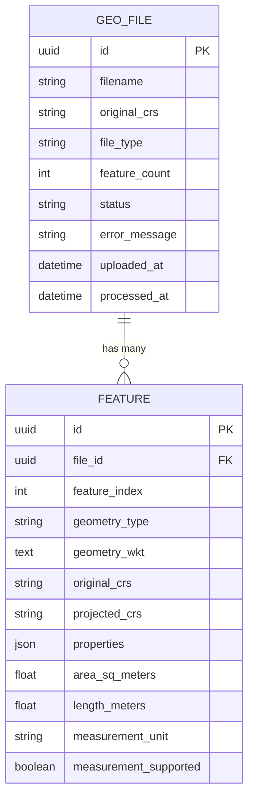
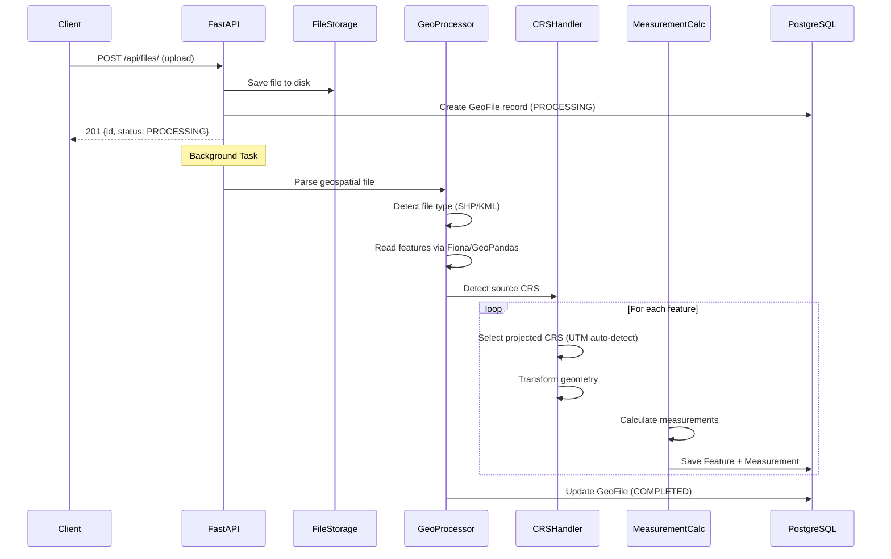

# 🌍 Geospatial File Measurement API — System Design Plan

## Overview
A production-grade backend service built with **FastAPI** + **PostgreSQL/PostGIS** that accepts geospatial files (Shapefile `.zip`, `.kml`), processes features, and returns measurement information.

---

## Architecture

```mermaid
graph TB
    Client["Client (REST)"] -->|POST /api/files/| Upload["Upload Endpoint"]
    Client -->|GET /api/files/{id}/| FileInfo["File Info Endpoint"]
    Client -->|GET /api/files/{id}/measurements/| Measurements["Measurements Endpoint"]
    
    Upload --> Validation["File Validation Layer"]
    Validation --> Storage["File Storage (disk)"]
    Storage --> Processing["Background Processing"]
    Processing --> GeoParsing["Geo Parser (Fiona/GDAL)"]
    GeoParsing --> CRSTransform["CRS Detection & Transform"]
    CRSTransform --> MeasureCalc["Measurement Calculator"]
    MeasureCalc --> DB["PostgreSQL + PostGIS"]
    
    FileInfo --> DB
    Measurements --> DB

    subgraph "Core Processing Pipeline"
        GeoParsing
        CRSTransform
        MeasureCalc
    end
```

## Technology Stack

| Layer | Technology | Rationale |
|-------|-----------|-----------|
| **Framework** | FastAPI | Async, auto OpenAPI docs, type-safe with Pydantic |
| **Database** | PostgreSQL + PostGIS | Native geospatial support, production-grade |
| **ORM** | SQLAlchemy 2.0 + GeoAlchemy2 | Async support, geospatial column types |
| **Migrations** | Alembic | Database schema versioning |
| **Geo Processing** | GeoPandas + Fiona + Shapely + pyproj | Industry-standard geo libraries |
| **Background Tasks** | FastAPI BackgroundTasks | Simple async processing (no Celery overhead) |
| **Validation** | Pydantic v2 | Request/response schema validation |
| **Testing** | pytest + httpx | Async-compatible testing |
| **Containerization** | Docker + docker-compose | Reproducible environments |

## Project Structure

```
Aereo/
├── app/
│   ├── __init__.py
│   ├── main.py                  # FastAPI app entry point
│   ├── config.py                # Settings & env config
│   ├── database.py              # DB engine, session factory
│   ├── models/
│   │   ├── __init__.py
│   │   ├── file.py              # GeoFile model
│   │   └── feature.py           # Feature + Measurement model
│   ├── schemas/
│   │   ├── __init__.py
│   │   ├── file.py              # File request/response schemas
│   │   └── feature.py           # Feature/measurement schemas
│   ├── api/
│   │   ├── __init__.py
│   │   ├── router.py            # API router aggregation
│   │   └── endpoints/
│   │       ├── __init__.py
│   │       └── files.py         # /api/files/ endpoints
│   ├── services/
│   │   ├── __init__.py
│   │   ├── file_service.py      # File upload & management logic
│   │   ├── geo_processor.py     # Geospatial file parsing
│   │   ├── crs_handler.py       # CRS detection & transformation
│   │   └── measurement.py       # Area/length calculation
│   └── utils/
│       ├── __init__.py
│       ├── file_utils.py        # File I/O helpers
│       └── exceptions.py        # Custom exception classes
├── alembic/
│   ├── env.py
│   └── versions/
├── uploads/                     # Uploaded file storage
├── tests/
│   ├── __init__.py
│   ├── conftest.py
│   ├── test_upload.py
│   ├── test_processing.py
│   └── test_measurements.py
├── alembic.ini
├── requirements.txt
├── Dockerfile
├── docker-compose.yml
├── .env.example
├── .gitignore
└── README.md
```

## Database Schema



## API Design

### 1. Upload File
```
POST /api/files/
Content-Type: multipart/form-data

Request: file (binary) — .zip (shapefile) or .kml
Response 201:
{
    "id": "uuid",
    "filename": "survey.kml",
    "status": "PROCESSING",
    "uploaded_at": "2026-10-07T14:30:00Z"
}
```

### 2. File Information
```
GET /api/files/{id}/

Response 200:
{
    "id": "abc123",
    "filename": "survey.kml",
    "file_type": "kml",
    "feature_count": 120,
    "crs": "EPSG:4326",
    "status": "COMPLETED",
    "uploaded_at": "2026-10-07T14:30:00Z",
    "processed_at": "2026-10-07T14:30:05Z"
}
```

### 3. Measurements
```
GET /api/files/{id}/measurements/

Response 200:
{
    "file_id": "abc123",
    "filename": "survey.kml",
    "total_features": 120,
    "measurements": [
        {
            "feature_index": 0,
            "geometry_type": "Polygon",
            "properties": {"name": "Zone A"},
            "area_sq_meters": 15234.56,
            "length_meters": null,
            "measurement_supported": true
        },
        {
            "feature_index": 1,
            "geometry_type": "Point",
            "properties": {"name": "Station 1"},
            "area_sq_meters": null,
            "length_meters": null,
            "measurement_supported": false,
            "note": "No measurement for Point geometry"
        }
    ]
}
```

## Processing Pipeline



## CRS Handling Strategy

> **Strategy: Auto UTM Zone Detection**

1. **Detect source CRS** from the file (e.g., `EPSG:4326`)
2. **Compute centroid** of all features
3. **Auto-select UTM zone** based on centroid longitude:
   - Northern hemisphere: `EPSG:326{zone}` 
   - Southern hemisphere: `EPSG:327{zone}`
   - UTM Zone = `floor((lon + 180) / 6) + 1`
4. **Transform geometries** using `pyproj.Transformer`
5. **Calculate measurements** in meters on projected coordinates

This approach ensures accurate area/length calculations regardless of input CRS.

## Measurement Logic

| Geometry Type | Measurement | Unit | Method |
|--------------|-------------|------|--------|
| Polygon / MultiPolygon | Area | m² | `shapely.area` on projected geometry |
| LineString / MultiLineString | Length | m | `shapely.length` on projected geometry |
| Point / MultiPoint | None | — | Gracefully skip |
| GeometryCollection | Per-component | Mixed | Iterate sub-geometries |
| Other | None | — | Graceful handling with note |

## Error Handling

| Scenario | Handling |
|----------|---------|
| Invalid file type | `422` — "Unsupported file format" |
| Corrupt/empty file | `422` — "Could not parse geospatial data" |
| Unsupported geometry | Skip measurement, set `measurement_supported: false` |
| Missing CRS | Assume `EPSG:4326`, add warning |
| Processing failure | Set status to `FAILED` with error message |
| File not found | `404` — "File not found" |

## Build Phases

### Phase 1: Foundation ✅
- [x] Project structure
- [x] Database models + migrations
- [x] Configuration management
- [x] Docker setup

### Phase 2: Core API
- [ ] File upload endpoint
- [ ] File info endpoint
- [ ] Measurements endpoint
- [ ] Request/response validation

### Phase 3: Geo Processing
- [ ] File type detection
- [ ] Shapefile parsing
- [ ] KML parsing
- [ ] CRS detection & transformation
- [ ] Measurement calculations

### Phase 4: Production Hardening
- [ ] Error handling & graceful degradation
- [ ] Logging
- [ ] Tests
- [ ] Documentation (README)

### Phase 5: Deployment
- [ ] Docker + docker-compose
- [ ] Environment configuration
- [ ] Final README with setup instructions
